# Tugas Praktikum Minggu 8 — Platform-Specific Features

**Mata Kuliah:** IF25-22017 Pengembangan Aplikasi Mobile  
**Program Studi:** Teknik Informatika — Institut Teknologi Sumatera  
**Tahun Akademik:** Genap 2025/2026

---

## Deskripsi Tugas
Melakukan upgrade pada **Notes App** berbasis Compose Multiplatform untuk mendukung fitur spesifik platform (*platform-specific features*) dengan arsitektur yang bersih (*clean separation*) menggunakan **Koin Dependency Injection** dan pola **expect/actual** untuk mengakses API native perangkat.

---

## Fitur yang Diimplementasikan
1. **Koin Dependency Injection (DI):**
   - Mengelola pembuatan dan resolusi seluruh dependensi secara modular (database driver, settings, repository, platform APIs, dan ViewModels).
   - Inisialisasi Koin secara aman di setiap platform entry point (`MyApplication` di Android, `main()` di Desktop JVM, dan `MainViewController` di iOS).
   - Resolusi ViewModel di Composable secara lifecycle-aware menggunakan block `viewModel { GlobalContext.get().get() }`.
2. **Platform Info (DeviceInfo) — expect/actual:**
   - Mendapatkan informasi nama perangkat, versi OS, dan versi aplikasi.
   - **Android:** Menggunakan `android.os.Build`.
   - **JVM (Desktop):** Menggunakan System properties (`os.name` & `os.version`).
   - **iOS:** Menggunakan `UIDevice.currentDevice`.
3. **Network Connection Monitor (NetworkMonitor) — expect/actual:**
   - Memonitor status internet perangkat secara real-time dan reaktif.
   - Menampilkan banner **🔌 Sedang Offline** secara dinamis menggunakan `AnimatedVisibility` di layar utama (`NoteListScreen`) saat koneksi terputus.
4. **Battery Status (BatteryInfo) — expect/actual [BONUS +10%]:**
   - Memonitor level baterai (persentase) dan status pengisian daya (*charging*).
   - Menampilkan detail baterai beserta indikator charging secara langsung di layar **Profil**.

---

## Diagram Arsitektur (Koin DI & Expect/Actual)

```mermaid
graph TD
    subgraph commonMain [commonMain]
        App[App.kt] --> VM[Notes/Profile ViewModel]
        VM --> Repo[NoteRepository]
        Repo --> DB[NotesDatabase]
        
        %% Expect declarations
        ExpectDevice[expect class DeviceInfo]
        ExpectNet[expect class NetworkMonitor]
        ExpectBat[expect class BatteryInfo]
        
        KoinCommon[Koin commonModule]
    end

    subgraph androidMain [androidMain]
        AppAndroid[MyApplication / MainActivity]
        ActualDeviceAndroid[actual class DeviceInfo]
        ActualNetAndroid[actual class NetworkMonitor]
        ActualBatAndroid[actual class BatteryInfo]
        KoinAndroid[platformModule Android]
    end

    subgraph jvmMain [jvmMain]
        AppJVM[main.kt]
        ActualDeviceJVM[actual class DeviceInfo]
        ActualNetJVM[actual class NetworkMonitor]
        ActualBatJVM[actual class BatteryInfo]
        KoinJVM[platformModule JVM]
    end

    subgraph iosMain [iosMain]
        AppiOS[MainViewController]
        ActualDeviceiOS[actual class DeviceInfo]
        ActualNetiOS[actual class NetworkMonitor]
        ActualBatios[actual class BatteryInfo]
        KoiniOS[platformModule iOS]
    end

    %% Wiring expect/actual
    ExpectDevice -.-> ActualDeviceAndroid
    ExpectDevice -.-> ActualDeviceJVM
    ExpectDevice -.-> ActualDeviceiOS

    ExpectNet -.-> ActualNetAndroid
    ExpectNet -.-> ActualNetJVM
    ExpectNet -.-> ActualNetiOS

    ExpectBat -.-> ActualBatAndroid
    ExpectBat -.-> ActualBatJVM
    ExpectBat -.-> ActualBatios

    %% DI Resolution
    KoinCommon --> VM
    KoinCommon --> Repo
    KoinAndroid --> KoinCommon
    KoinJVM --> KoinCommon
    KoiniOS --> KoinCommon
```

---

## Tampilan Aplikasi (Screenshots)

*Silakan masukkan screenshot tampilan aplikasi Anda di bawah ini:*

### 1. Device Info & Battery Status (Profile Screen)
<!-- SILAKAN MASUKKAN GAMBAR SCREENSHOT DEVICE INFO & BATERAI DI SINI -->
*(Contoh format: ``)*

### 2. Network Indicator Banner (Offline Banner)
<!-- SILAKAN MASUKKAN GAMBAR SCREENSHOT BANNER OFFLINE DI SINI -->
*(Contoh format: ``)*

---

## Video Demonstrasi Pengerjaan

*Silakan masukkan link/embed video demonstrasi (durasi ~45 detik) di bawah ini:*

<!-- SILAKAN MASUKKAN LINK VIDEO DEMO DI SINI (Google Drive/YouTube/GitHub Video) -->
- **Link Video Demo:** [Tonton Video Demo di Sini](TULIS_LINK_VIDEO_DI_SINI)

*Video mendemonstrasikan:*
1. Kelancaran Dependency Injection (DI) via Koin.
2. Tampilan info perangkat & status baterai di menu Profil.
3. Fungsionalitas network status indicator (banner muncul saat Airplane Mode aktif / Wi-Fi mati, dan hilang saat online kembali).
